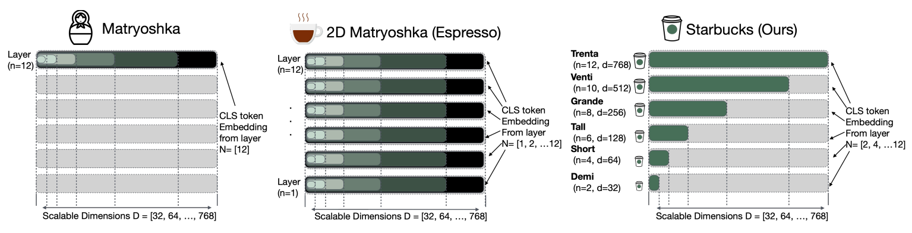

# Starbucks
Starbucks: Improved Training for 2D Matryoshka Embeddings
<p align="center">
  
</p>

We propose Starbucks: a new 2D MRL fine-tuning and pre-training method.

Starbucks is composed of two key processes: the Starbucks Masked Autoencoding (SMAE) pretraining and the Starbucks Representation Learning (SRL) fine-tuning processes.

In Starbucks, the  model loss is computed based on a limited target list of layer-dimension pairs, ranging from smaller to larger sizes, much like how the coffeehouses chain [Starbucks](https://en.wikipedia.org/wiki/Starbucks) offers coffee in different cup sizes, from Demi to Trenta.

## General guidelines
Our codebase is built on top of torch and transformers.

We recommend using a conda environment to install the required dependencies.
To install the required dependencies:

```bash
conda create -n starbucks python=3.10
conda activate starbucks

pip install torch
pip install transformers datasets peft
pip install deepspeed accelerate
```

For SMAE pre-training, see [smae](smae/README.md).

For SRL fine-tuning on retrieval task, see [retrieval](retrieval/README.md).

For SRL fine-tuning on STS task, see [sts](sts/README.md).

## Model Checkpoints

We released our model checkpoints on Hugging Face Model Hub: 

Pre-trained SMAE: [bert-base-uncased-fineweb100bt-smae](https://huggingface.co/ielabgroup/bert-base-uncased-fineweb100bt-smae)

Fine-tuned Starbucks_STS: [Starbucks_STS](https://huggingface.co/ielabgroup/Starbucks_STS)

Fine-tuned Starbucks_Retrieval: [Starbucks-msmarco](https://huggingface.co/ielabgroup/Starbucks-msmarco)